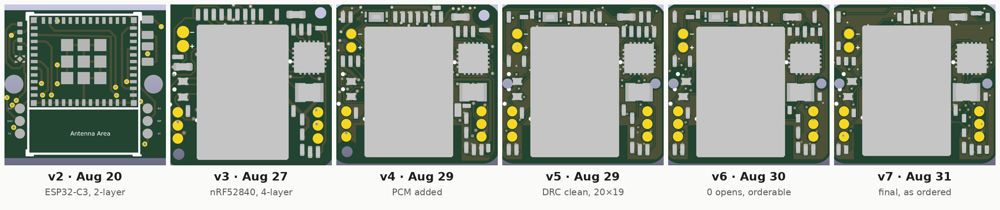
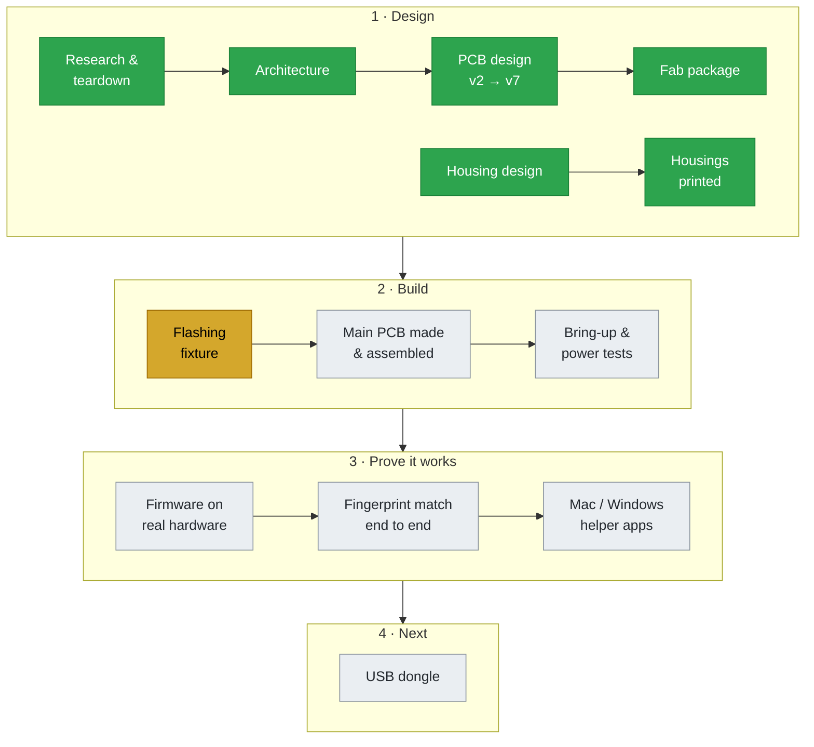

# touch-id: a fingerprint knob for the NuPhy Air75 V3

A drop-in fingerprint-authentication module that replaces the knob in the
top-right corner of a **NuPhy Air75 V3**. Touch it and it confirms your identity
to the paired computer wirelessly, without a $149 Touch ID keyboard.

> [!WARNING]
> **Work in progress.** The design is finished on screen, but nothing has been
> proven on real hardware yet. The main PCB hasn't been ordered or built yet,
> the firmware hasn't been built or run on the board, and none of it has been
> tested end to end. See [Project status](#project-status) for exactly where
> things stand.

This repo is the **complete design history**, commit by commit. Every wrong
turn, reverted fix and checker bug is still in it, because that is where most
of the engineering happened. Start with **[JOURNEY.md](JOURNEY.md)** for the
story and links to the commits that matter, or browse the
[tags](https://github.com/Drivera0/touch-id-public/tags) for the milestones.

## The problem

- The Air75 V3 runs NuPhy's closed firmware (no QMK), so the keyboard can't be
  taught about a sensor. The module is an **independent sidecar**: it uses the
  knob slot as a mount and does its own sensing, crypto and radio.
- The slot supplies **no power rail** (J11 turned out to be the RGB LED
  connector). The module harvests from the backlight LED pins and runs from a
  protected 80 mAh coin cell.
- The whole board is **20 × 19 mm, 4 layers**, around a Raytac MDBT50Q
  (nRF52840) module, with a Hi-Link ZW0922 fingerprint sensor above it in a
  printed nylon housing.

## Project status

*Last updated September 2026.*

Green = done, yellow = in progress, grey = not started.

| Stage | Status | Notes |
|---|---|---|
| Research and keyboard teardown | Done | Pin and power measurements on the real keyboard (`docs/bench/`) |
| Architecture | Done | Independent sidecar, harvests the backlight pins, protected coin cell |
| PCB design | Done (on screen) | v7 passes all 22 pre-order checks and DRC. Never built. |
| Housing | Printed | Both housing variants printed in MJF nylon and look good. Not yet fitted with a real board. |
| Fab package | Ready | Gerbers, BOM and placement verified against each other |
| Flashing fixture | In progress | The first printed pogo-pin jig failed, so it's being replaced by a custom carrier PCB and a 3D-printed flash frame (`cad/carrier-v1`). Both are ordered. |
| Main PCB | Not ordered yet | Design and fab files are ready; it gets ordered once all the parts are in hand |
| Bring-up and power tests | Not started | Needs a built board |
| Firmware | Not started on hardware | Architecture and protocols are designed (`docs/firmware/`). The firmware hasn't been built for or run on a real board. The source is closed; see [firmware/](firmware/README.md). |
| Fingerprint matching end to end | Not started | |
| Host apps (Mac / Windows) | Prototype | Early helper-app experiments; not tested with a real module |
| USB dongle | Design study | Size and module trade studies in `docs/dongle/` |

## What's here

| Folder | What's in it |
|---|---|
| `docs/design/` | **Start with `DESIGN-SPEC.md`**: every dimension, land pattern and constraint, each traced to a vendor drawing or a geometric check. Also architecture, mechanical design, part library and the original project overview. |
| `docs/bench/` | How the keyboard's pins and power were measured: teardown, pin and harvest test procedures and results |
| `docs/build/` | Assembly guide, JLCPCB DFM report, shopping list |
| `docs/firmware/` | Sensor protocol, auth crypto, flashing, fork audit, roadmap |
| `docs/dongle/` | USB dongle trade studies |
| `docs/renders/` | Board renders v2 → v7 |
| `cad/` | Boards v2 → v5 (`cad/pcb-v2`, `cad/pcb-v3`, `cad/_archive`), housing generators and exports, the flashing fixture (`cad/carrier-v1`) |
| `cad/pcb-v3/*.py` | The verification tools (`preflight.py`: 22 checks, `pour_truth.py`, `check_board.py`, `verify_gerbers.py`) and the routing and repair tools |
| `notes/` | Working notes and handoffs written during the build |
| `firmware/` | A pointer: the source is closed, binaries come as Releases |
| `tools/` | Third-party KiCad routing tools (MIT) |

## Not in this repo

This is a portfolio of the design process. The parts needed to manufacture
the product are kept private, and were removed from the **entire history**,
not just the latest commit:

- The final board (v6 and v7) KiCad files, gerbers, BOM and pick-and-place.
  Rendered images of them are included.
- The final (v6) housing generator and its STL/STEP exports
- The board generator script (`build_pcb_v3.py`)
- Firmware and helper-app source code. The design docs and commit history stay.
- Vendor datasheets (copyrighted; links are in `cad/pcb-v3/COMPONENT-REFERENCE.md`),
  supplier quotes and contact details

Commit messages and docs may refer to these files. That's expected.

## Tools

KiCad 10, Altium (cross-check), CadQuery, Python, Zephyr on nRF52840,
JLCPCB PCBA and MJF nylon printing.

## Credits and license

Inspired by [tinyTouch](https://github.com/ZimengXiong/tinyTouch) by Zimeng Xiong and by
[YubiKey](https://www.yubico.com/products/).
`tools/com_github_drandyhaas_kicadroutingtools` is © drandyhaas, MIT licensed
(see its LICENSE).

Everything else: **© 2026 Driver. All rights reserved.** You're welcome to
read it and learn from it. Please ask before reusing it.
