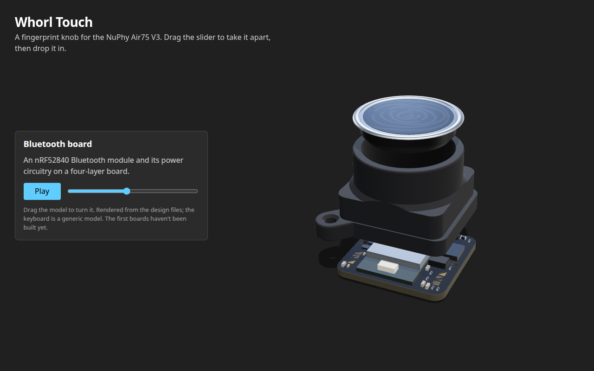
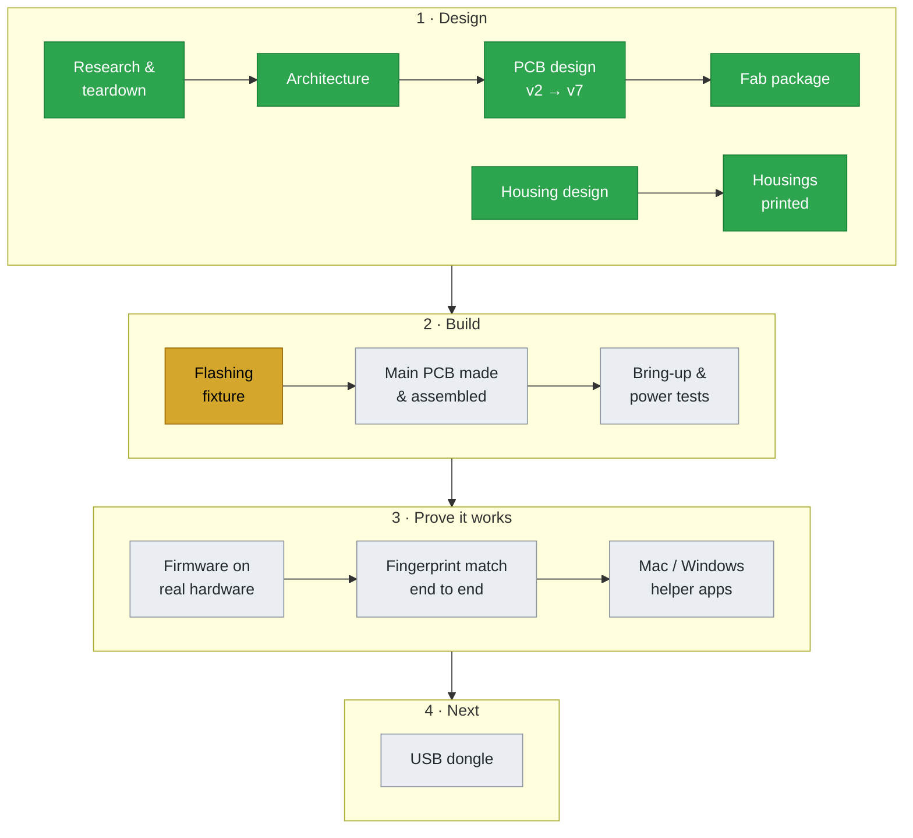

# Whorl Touch: a fingerprint knob for the NuPhy Air75 V3

A drop-in fingerprint-authentication module that replaces the knob in the
top-right corner of a **NuPhy Air75 V3**. Touch it and it confirms your identity
to the paired computer wirelessly, without a $149 Touch ID keyboard.

> [!WARNING]
> **Work in progress.** The design is finished on screen, but nothing has been
> proven on real hardware yet. The main PCB hasn't been ordered or built yet,
> the firmware hasn't been built or run on the board, and none of it has been
> tested end to end. See [Project status](#project-status) for exactly where
> things stand.

**[Open the interactive 3D model](https://drivera0.github.io/whorl-touch-public/)**:
drag to turn it, slide to take it apart
([or open it already apart](https://drivera0.github.io/whorl-touch-public/?at=0.45)),
then watch it drop into the keyboard.

This repo is the project's public face: the story of how it was designed, and
a 3D model of the module. **[JOURNEY.md](JOURNEY.md)** tells the story; the
design files themselves are private.

## The problem

- The Air75 V3 runs NuPhy's closed firmware (no QMK), so the keyboard can't be
  taught about a sensor. The module is an **independent sidecar**: it uses the
  knob slot as a mount and does its own sensing, crypto and radio.
- The slot supplies **no power**, so the module harvests its own energy and
  runs from a protected 77 mAh coin cell.
- The board is a small 4-layer design around an nRF52840 module, with a
  fingerprint sensor above it in a printed nylon housing.

## Project status

*Last updated September 2026.*

```mermaid
flowchart TB
  subgraph S1["1 · Design"]
    direction LR
    A["Research &<br/>teardown"] --> B["Architecture"] --> C["PCB design<br/>v2 → v7"] --> E["Fab package"]
    D["Housing design"] --> F["Housings<br/>printed"]
  end
  subgraph S2["2 · Build"]
    direction LR
    G["Flashing<br/>fixture"] --> H["Main PCB made<br/>& assembled"] --> I["Bring-up &<br/>power tests"]
  end
  subgraph S3["3 · Prove it works"]
    direction LR
    J["Firmware on<br/>real hardware"] --> K["Fingerprint match<br/>end to end"] --> L["Mac / Windows<br/>helper apps"]
  end
  subgraph S4["4 · Next"]
    direction LR
    M["USB dongle"]
  end
  S1 --> S2 --> S3 --> S4

  classDef done fill:#2da44e,stroke:#1a7f37,color:#fff
  classDef doing fill:#d4a72c,stroke:#9a6700,color:#000
  classDef todo fill:#eaeef2,stroke:#8c959f,color:#24292f
  class A,B,C,D,E,F done
  class G doing
  class H,I,J,K,L,M todo
```

Green = done, yellow = in progress, grey = not started.

| Stage | Status | Notes |
|---|---|---|
| Research and keyboard teardown | Done | Every slot contact characterised by measurement (method and results private) |
| Architecture | Done | Independent sidecar, harvests its own energy, protected coin cell |
| PCB design | Done (on screen) | v7 passes all 22 pre-order checks and DRC. Never built. |
| Housing | Printed | Both housing variants printed in MJF nylon and look good. Not yet fitted with a real board. |
| Fab package | Ready | Gerbers, BOM and placement verified against each other |
| Flashing fixture | In progress | The first printed pogo-pin jig failed, so it's being replaced by a custom carrier PCB and a 3D-printed flash frame. |
| Main PCB | Not ordered yet | Design and fab files are ready; it gets ordered once all the parts are in hand |
| Bring-up and power tests | Not started | Needs a built board |
| Firmware | Not started on hardware | Architecture and protocols are designed. The firmware hasn't been built for or run on a real board. The source is closed; see [firmware/](firmware/README.md). |
| Fingerprint matching end to end | Not started | |
| Host apps (Mac / Windows) | Prototype | Early helper-app experiments; not tested with a real module |
| USB dongle | Design study | Size and module trade studies done |

## What's here

| Path | What's in it |
|---|---|
| `JOURNEY.md` | How the design got built, milestone by milestone |
| `docs/` | The interactive 3D model, served by GitHub Pages |
| `firmware/` | A pointer: the source is closed, binaries come as Releases |
| `THIRD-PARTY-NOTICES.md` | Credits and licences for third-party work |

## Not in this repo

The files needed to build the product are private:

- Board source and fab files, board renders, and the flashing fixture
- The keyboard-slot work: how it was mapped, what each contact carries, the
  measurements and the design docs that record them
- The housing and board generators, and the engineering notes and design docs
- Firmware and helper-app source code
- Vendor datasheets (copyrighted), supplier quotes and contact details

## Tools

KiCad 10, Altium (cross-check), CadQuery, Python, Zephyr on nRF52840,
JLCPCB PCBA and MJF nylon printing.

## Credits and license

Inspired by [tinyTouch](https://github.com/ZimengXiong/tinyTouch) by Zimeng Xiong and by
[YubiKey](https://www.yubico.com/products/).

Everything else: **© 2026 Driver. All rights reserved.** You're welcome to
read it and learn from it. Please ask before reusing it.
